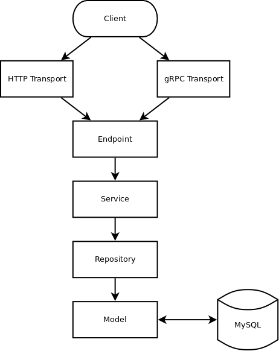

# auth microservice of recreationroom project
## Architecture

Note: If the service grows larger, entity and dao layers may be added as well.

# REST APIs
## User service(Registration service)
| API                       | Description
| ------------------------- | --------------
| GET /users                | List all users
| POST /users               | Create user/User registration
| GET /users/{id}           | Get user
| PATCH /users/{id}         | Update user
| DELETE /users/{id}        | Delete user/unregister
| POST /users/{id}/password | Reset password(need password reset token)
| PUT /users/{id}/password  | Update password(need current password)
| GET /password/reset       | Send password reset link through email
